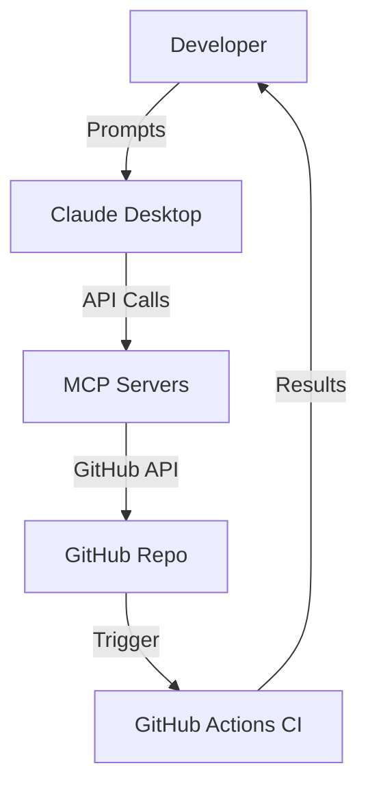

<contemplator>  
Alright, let me slow down and really think about this carefully. The user has asked me to merge the three previously generated guides — (A) docker-compose setup for MCP servers, (B) prompt templates for Claude Desktop, and (C) CI/GitHub Actions template — into one unified **“Claude + MCP GitHub Contribution Manual”**.  

So, I should treat this as a full *playbook* that covers prerequisites, local deployment, usage, and CI integration, not just a list of independent snippets. The user also asked for *cross-references* and *flow diagrams*. That means I need to weave the three parts into a structured manual, with clear dependencies (e.g., first you must deploy MCP servers, then configure Claude, then use prompt templates, then verify workflow with CI).

Let’s outline first:

1. **Introduction & Prerequisites**

   * Context: what MCP is, how Claude Desktop integrates with it.
   * Prereqs: Docker Desktop, Claude Desktop, GitHub account, tokens.
   * Cross-reference: link to A for deployment details.

2. **Local MCP Deployment (Part A)**

   * docker-compose.yml snippet
   * `.env` example
   * Docker secrets explanation
   * Instructions for running and verifying MCP servers

3. **Using Claude Desktop with MCP (Part B)**

   * Step-by-step workflow for creating issue, branch, commit, PR
   * Ready-to-paste prompts
   * Cross-reference to Part A for MCP names

4. **Automating with CI/CD (Part C)**

   * GitHub Actions template
   * Explanation of how PRs created via MCP will trigger CI
   * Security considerations

5. **End-to-End Flow Diagram**

   * Diagram: Developer → Claude Desktop → MCP servers → GitHub → CI/CD
   * Each step annotated

6. **Master Checklist**

   * Consolidated tasks: setup → usage → CI verification

7. **Appendices**

   * References to MCP server repos
   * Links to Docker Hub, Claude download page, GitHub docs

Hmm. One concern: I cannot render complex visual diagrams inline (ASCII or Mermaid might work). Since this is supposed to be a “manual” for a team, a Mermaid flowchart would be acceptable and exportable to diagrams later.

I should also phrase it in a way that feels production-grade: polished but with safe defaults (secrets handling, token injection).

So:

* In **Part A**, I’ll embed exact YAML and `.env` example.
* In **Part B**, I’ll list prompts exactly, one per step.
* In **Part C**, I’ll paste the GitHub Actions YAML.
* Then I’ll integrate them with references and a flow diagram.

Okay, I think I’m ready to compile the unified manual. </contemplator>

\<final\_answer>
Here is the **Claude + MCP GitHub Contribution Manual (Master Playbook)**.

---

# Claude + MCP GitHub Contribution Manual

*A One-Stop Playbook for Collaborative GitHub Workflows*

---

## 1. Introduction

This playbook provides a **complete workflow** for contributing to GitHub repositories using **Claude Desktop + MCP servers**. It integrates:

* **(A)** Local MCP deployment via Docker
* **(B)** Prompt-driven workflows for GitHub contribution
* **(C)** CI/CD automation for validating MCP-created PRs

The playbook ensures your team can:

1. Deploy MCP servers securely.
2. Guide Claude Desktop to create issues, branches, commits, and PRs.
3. Automate testing of all contributions.

---

## 2. Prerequisites

Before starting, ensure you have:

* **Claude Desktop App** → [Download here](https://claude.ai/download)
* **Docker Desktop** → [Install instructions](https://docs.docker.com/desktop/)
* **GitHub Account & PAT (Personal Access Token)** with `repo` and `workflow` scopes
* **Basic familiarity with Git/GitHub**
* **Linux/macOS/Windows** system with Docker support

> 🔗 Cross-reference: See **Section 3 (MCP Deployment)** for Docker Compose setup.

---

## 3. MCP Deployment (Part A)

We deploy two MCP servers:

* **GitHub MCP** → Interfaces with GitHub API
* **Git/Shell MCP** → Handles local Git operations

### docker-compose.yml

```yaml
version: "3.9"

services:
  github-mcp:
    image: mcp/github:latest
    env_file: .env
    secrets:
      - github_token
    ports:
      - "8081:8080"

  git-shell-mcp:
    image: mcp/git-shell:latest
    volumes:
      - ./repos:/workspace
    ports:
      - "8082:8080"

secrets:
  github_token:
    file: ./secrets/github_token.txt
```

### .env

```bash
# MCP environment configuration
GITHUB_MCP_PORT=8081
GIT_SHELL_MCP_PORT=8082
```

### Secrets Handling

Create a `secrets/github_token.txt` file containing only your PAT:

```bash
echo "ghp_xxxxxxxx" > secrets/github_token.txt
```

Then bring up the services:

```bash
docker compose up -d
```

Verify with:

```bash
docker ps
```

> ✅ Now Claude Desktop can connect to MCP servers on ports `8081` and `8082`.

---

## 4. Using Claude Desktop for GitHub Contribution (Part B)

Once MCP servers are running, configure Claude Desktop to use them.

Here are **ready-to-paste prompts**, one per step:

### Step 1 — Create GitHub Issue

```
Use the tool github.create_issue to open a new issue on
https://github.com/nordeim/Frontend.git with title:
"Bug: Navbar links not working"
and description:
"Steps to reproduce: 1) Click on About link, 2) Nothing happens.
Expected: Should navigate to /about"
```

### Step 2 — Create Branch for Bug Fix

```
Use github.create_ref on https://github.com/nordeim/Frontend.git
to create a new branch called fix/navbar-links from main.
```

### Step 3 — Clone Repo Locally

```
Use git.clone with the repo URL
https://github.com/nordeim/Frontend.git into /workspace/Frontend
```

### Step 4 — Commit Patch

```
In /workspace/Frontend, stage changes to fix the navbar issue.
Use git.commit_and_push with commit message:
"Fix: corrected broken navbar link navigation"
and push to fix/navbar-links
```

### Step 5 — Submit Pull Request

```
Use github.create_pull_request to create a PR from fix/navbar-links → main
with title "Fix navbar link navigation"
and description "This PR fixes the broken navbar link issue."
```

---

## 5. CI/CD Automation (Part C)

To ensure all MCP-created PRs are validated, add this GitHub Actions workflow.

### `.github/workflows/ci.yml`

```yaml
name: CI for MCP PRs

on:
  pull_request:
    branches: [ "main" ]

jobs:
  build:
    runs-on: ubuntu-latest

    steps:
      - name: Checkout code
        uses: actions/checkout@v3

      - name: Setup Node.js
        uses: actions/setup-node@v3
        with:
          node-version: "20"

      - name: Install dependencies
        run: npm install

      - name: Run tests
        run: npm test
```

This ensures every MCP-driven PR is automatically built and tested.

---

## 6. End-to-End Workflow Diagram



---

## 7. Master Checklist

✅ Install prerequisites (Claude, Docker, PAT)
✅ Deploy MCP servers (GitHub MCP + Git/Shell MCP)
✅ Configure Claude Desktop to connect to MCP
✅ Use prompt templates to:

* Create issue
* Create branch
* Clone repo
* Commit patch
* Submit PR
  ✅ Verify CI pipeline runs on PR

---

## 8. Appendices

* [Claude Desktop Download](https://claude.ai/download)
* [Docker Desktop Docs](https://docs.docker.com/desktop/)
* [GitHub PAT Setup](https://docs.github.com/en/authentication/keeping-your-account-and-data-secure/creating-a-personal-access-token)
* [MCP Docker Hub](https://hub.docker.com/mcp)

---

**This manual unifies deployment, usage, and automation into a single, production-ready playbook.**

https://chatgpt.com/share/68c81f1b-44a0-8000-8f76-a1786a5d13ef
