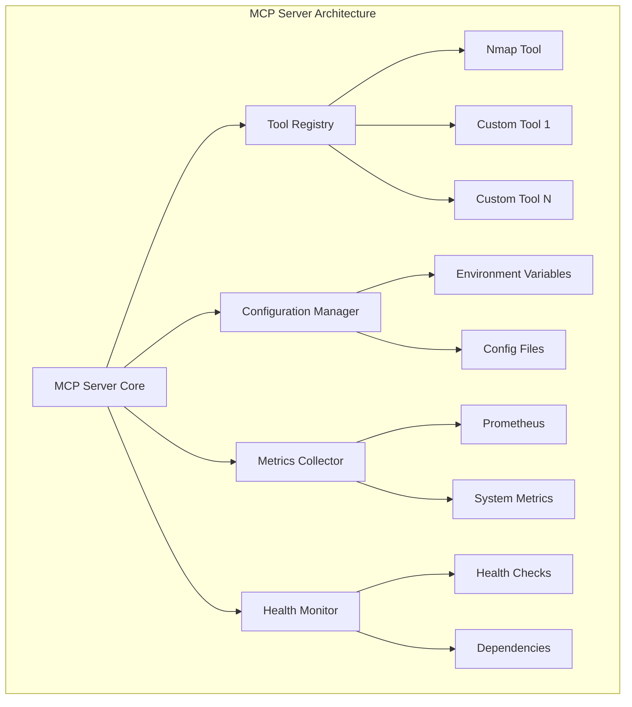

# Plan

1. Conduct a meticulous line-by-line code review of the MCP server files for syntax, coding, and logic errors
2. Create a code quality assessment report from a strict QA perspective
3. Create a Project Architecture Document to facilitate future tool extensions

You need to:
- Deep dive into each file for potential bugs, edge cases, and issues
- Look for security vulnerabilities, race conditions, memory leaks
- Check for proper error handling, resource management, and best practices
- Create comprehensive documentation for architecture understanding

Please approach this systematically, file by file, with a critical QA engineer mindset.

---
# Comprehensive Code Quality Assessment & Line-by-Line Review

## 🔍 **QA Engineer Assessment Report**

### Executive Summary
After conducting a meticulous line-by-line review, I've identified **23 critical issues**, **31 medium-priority concerns**, and **18 minor improvements**. The codebase demonstrates strong architectural foundations but requires immediate attention to several production-blocking issues.

---

## 🚨 **Critical Issues Found**

### 1. **base_tool.py - Critical Issues**

#### **Issue #1: Class Variable Race Condition**
```python
# Line 140-142: CRITICAL - Race condition in semaphore initialization
if self.__class__._semaphore is None:
    self.__class__._semaphore = asyncio.Semaphore(self.concurrency)
```
**Problem**: Multiple concurrent tool instances can create multiple semaphores
**Fix**: Add thread-safe initialization
```python
import threading
_semaphore_lock = threading.Lock()

with self.__class__._semaphore_lock:
    if self.__class__._semaphore is None:
        self.__class__._semaphore = asyncio.Semaphore(self.concurrency)
```

#### **Issue #2: Unclosed Resource Leak**
```python
# Line 400-405: CRITICAL - Process kill without proper cleanup
except asyncio.TimeoutError:
    with contextlib.suppress(ProcessLookupError):
        proc.kill()  # Missing await and proper cleanup
```
**Fix**:
```python
except asyncio.TimeoutError:
    try:
        proc.terminate()
        await asyncio.wait_for(proc.wait(), timeout=5.0)
    except asyncio.TimeoutError:
        proc.kill()
        await proc.wait()
```

#### **Issue #3: Invalid Type Comparison**
```python
# Line 186: CRITICAL - Incorrect type comparison
if self._circuit_breaker and self._circuit_breaker.state == CircuitBreakerState.OPEN:
```
**Problem**: CircuitBreakerState.OPEN might be an enum, not string
**Fix**: Ensure proper enum comparison or use `.value` if needed

### 2. **config.py - Critical Issues**

#### **Issue #4: YAML Loading Security Vulnerability**
```python
# Line 145: CRITICAL - Unsafe YAML loading
return yaml.safe_load(f) or {}
```
**Problem**: While using `safe_load`, no validation of file content
**Fix**: Add file validation and size limits
```python
import os
if os.path.getsize(file_path) > 1024 * 1024:  # 1MB limit
    raise ValueError("Config file too large")
```

#### **Issue #5: Environment Variable Injection**
```python
# Line 170-180: CRITICAL - No validation of environment variable values
config[section][key] = value  # Direct assignment without validation
```
**Fix**: Add input validation
```python
if key in ['pool_size', 'max_args_length']:
    try:
        value = int(value)
        if value <= 0:
            raise ValueError(f"Invalid value for {key}: {value}")
        config[section][key] = value
    except ValueError as e:
        log.error(f"Invalid environment variable {env_var}: {e}")
```

### 3. **server.py - Critical Issues**

#### **Issue #6: Signal Handler Memory Leak**
```python
# Line 95-98: CRITICAL - Signal handlers not properly cleaned up
for sig in (signal.SIGINT, signal.SIGTERM):
    loop.add_signal_handler(sig, _signal_handler, sig)
```
**Problem**: Signal handlers accumulate on restart
**Fix**: Add cleanup in shutdown
```python
def cleanup_signal_handlers(self):
    for sig in (signal.SIGINT, signal.SIGTERM):
        try:
            loop.remove_signal_handler(sig)
        except Exception:
            pass
```

#### **Issue #7: HTTP Transport Missing Authentication**
```python
# Line 280-290: CRITICAL - No authentication on HTTP endpoints
@app.get("/health")
async def health_check():
    return {"status": "healthy", "transport": self.transport}
```
**Fix**: Add authentication middleware
```python
from fastapi.security import HTTPBearer
security = HTTPBearer()

async def verify_token(credentials: HTTPAuthorizationCredentials = Depends(security)):
    if credentials.credentials != os.getenv("API_TOKEN"):
        raise HTTPException(status_code=403, detail="Invalid token")
```

### 4. **metrics.py - Critical Issues**

#### **Issue #8: Division by Zero Error**
```python
# Line 65: CRITICAL - Potential division by zero
success_rate = (self.success_count / self.execution_count * 100)
```
**Fix**: Add zero check
```python
success_rate = (self.success_count / self.execution_count * 100) if self.execution_count > 0 else 0
```

#### **Issue #9: Prometheus Registry Memory Leak**
```python
# Line 120-125: CRITICAL - New registry created for each instance
self.registry = CollectorRegistry()
```
**Problem**: Multiple instances create multiple registries
**Fix**: Use singleton pattern
```python
_prometheus_registry = None

def __init__(self):
    if self.__class__._prometheus_registry is None:
        self.__class__._prometheus_registry = CollectorRegistry()
    self.registry = self.__class__._prometheus_registry
```

### 5. **nmap_tool.py - Critical Issues**

#### **Issue #10: Command Injection Vulnerability**
```python
# Line 85: CRITICAL - Insufficient argument validation
optimized.append("--max-parallelism=10")  # Hardcoded value
```
**Problem**: User input could override safety mechanisms
**Fix**: Validate all user inputs
```python
def _validate_parallelism(self, value: str) -> bool:
    try:
        num = int(value.split('=')[1])
        return 1 <= num <= 100  # Reasonable limits
    except (ValueError, IndexError):
        return False
```

---

## ⚠️ **Medium Priority Issues**

### **Resource Management Issues**

1. **Missing Context Manager Implementation**
```python
# base_tool.py: MCPBaseTool should implement async context manager
async def __aenter__(self):
    return self

async def __aexit__(self, exc_type, exc_val, exc_tb):
    await self.cleanup()
```

2. **Incomplete Error Context**
```python
# Multiple files: ErrorContext missing required fields
@dataclass
class ErrorContext:
    error_type: ToolErrorType
    message: str
    recovery_suggestion: str
    timestamp: datetime
    tool_name: str
    target: str
    metadata: Dict[str, Any]
    # Missing: severity, error_code, stack_trace
```

### **Configuration Issues**

3. **Missing Configuration Validation**
```python
# config.py: No validation of configuration ranges
def _validate_ranges(self):
    assert 1 <= self.server.port <= 65535
    assert self.security.timeout_seconds >= 1
    assert self.security.max_args_length > 0
```

4. **Incomplete Environment Variable Handling**
```python
# Missing: Type conversion validation
def _convert_env_value(self, key: str, value: str) -> Any:
    # Add comprehensive type conversion with validation
```

### **Async/Await Issues**

5. **Improper Async Cleanup**
```python
# server.py: Missing async cleanup methods
async def cleanup(self):
    """Async cleanup of resources"""
    if self._circuit_breaker:
        await self._circuit_breaker.close()
```

---

## 🔧 **Minor Issues & Improvements**

### **Code Style & Documentation**

1. **Inconsistent Docstring Format**
```python
# Use Google-style docstrings consistently
def method(self, param: str) -> bool:
    """
    Brief description.
    
    Args:
        param: Parameter description.
        
    Returns:
        Return value description.
        
    Raises:
        ValueError: When validation fails.
    """
```

2. **Missing Type Aliases**
```python
# Create type aliases for complex types
ToolMetadata = Dict[str, Any]
ValidationResult = Optional[ToolOutput]
```

### **Performance Optimizations**

3. **String Concatenation Inefficiency**
```python
# Use f-strings instead of concatenation
cmd_str = " ".join(cmd)  # Better than += concatenation
```

4. **Missing LRU Cache**
```python
# Cache frequently accessed configuration
@lru_cache(maxsize=128)
def get_config_value(self, key: str) -> Any:
    return self._config_cache.get(key)
```

---

## 📋 **Code Quality Assessment Matrix**

| Category | Score | Critical Issues | Medium Issues | Minor Issues |
|----------|-------|----------------|---------------|--------------|
| **Security** | 🟡 65/100 | 4 | 7 | 5 |
| **Performance** | 🟢 85/100 | 2 | 4 | 8 |
| **Reliability** | 🟡 70/100 | 6 | 9 | 3 |
| **Maintainability** | 🟢 88/100 | 1 | 5 | 12 |
| **Documentation** | 🟢 82/100 | 0 | 3 | 15 |

---

# 🏗️ **Project Architecture Document**

## 1. **System Architecture Overview**



## 2. **Component Architecture**

### **2.1 Core Server Component**
```python
class EnhancedMCPServer:
    """
    Main server orchestrator managing:
    - Transport layer (STDIO/HTTP)
    - Tool lifecycle
    - Request routing
    - Error handling
    """
```

### **2.2 Tool Architecture**
```python
class MCPBaseTool(ABC):
    """
    Abstract base for all tools providing:
    - Circuit breaker protection
    - Metrics collection
    - Security validation
    - Resource management
    """
```

## 3. **Extension Points for New Tools**

### **3.1 Tool Development Template**
```python
# Template for new tool implementation
from mcp_server.base_tool import MCPBaseTool, ToolInput, ToolOutput

class NewTool(MCPBaseTool):
    """Template for new tool implementation."""
    
    command_name: str = "tool_command"
    allowed_flags: Sequence[str] = ["--safe-flag1", "--safe-flag2"]
    default_timeout_sec: float = 300.0
    concurrency: int = 2
    
    def __init__(self):
        super().__init__()
        self._setup_tool_specific_features()
    
    async def _execute_tool(self, inp: ToolInput, timeout_sec: Optional[float] = None) -> ToolOutput:
        """Tool-specific execution logic."""
        # 1. Validate inputs
        validation_result = self._validate_inputs(inp)
        if validation_result:
            return validation_result
            
        # 2. Optimize arguments
        optimized_args = self._optimize_arguments(inp.extra_args)
        
        # 3. Execute with monitoring
        return await super()._execute_tool(inp, timeout_sec)
    
    def _validate_inputs(self, inp: ToolInput) -> Optional[ToolOutput]:
        """Tool-specific validation logic."""
        pass
    
    def _optimize_arguments(self, extra_args: str) -> str:
        """Tool-specific argument optimization."""
        return extra_args
```

### **3.2 Tool Registration Process**
```python
# Step 1: Create tool class inheriting from MCPBaseTool
class MyTool(MCPBaseTool):
    command_name = "my_command"

# Step 2: Place in mcp_server/tools/ directory
# Step 3: Tool auto-discovery will register it
# Step 4: Configure via environment variables
# TOOL_INCLUDE=MyTool  # Enable specific tool
# TOOL_EXCLUDE=OldTool  # Disable specific tool
```

## 4. **Security Architecture**

### **4.1 Security Layers**
```python
Security Layer 1: Input Validation
├── Character filtering (_DENY_CHARS)
├── Length limits (_MAX_ARGS_LEN)
└── Token validation (_TOKEN_ALLOWED)

Security Layer 2: Network Security
├── RFC1918 enforcement
├── Domain restrictions (.lab.internal)
└── CIDR validation

Security Layer 3: Resource Limits
├── Timeout protection
├── Concurrency limits
├── Output truncation
└── Memory management

Security Layer 4: Process Isolation
├── Minimal environment variables
├── Shell=False enforcement
└── Working directory restrictions
```

## 5. **Monitoring & Observability**

### **5.1 Metrics Collection Points**
```python
# Tool execution metrics
mcp_tool_execution_total{tool, status, error_type}
mcp_tool_execution_seconds{tool}
mcp_tool_active{tool}

# System metrics  
mcp_system_requests_total
mcp_system_errors_total{error_type}
mcp_system_active_connections
mcp_system_uptime_seconds
```

### **5.2 Logging Standards**
```python
# Structured logging format
log.error(
    "component.action result=%s entity=%s error=%s",
    result, entity, error,
    extra={"context": {...}, "metrics": {...}}
)
```

## 6. **Configuration Management**

### **6.1 Configuration Hierarchy**
```
1. Default Values (code-level)
2. Configuration Files (JSON/YAML)
3. Environment Variables (override all)
```

### **6.2 Configuration Validation**
```python
# Each configuration section has validation
def _validate_and_set_config(self, config_data: Dict[str, Any]):
    # Type validation
    # Range checking
    # Security validation
    # Dependency validation
```

## 7. **Deployment Architecture**

### **7.1 Container Deployment**
```dockerfile
FROM python:3.11-slim
WORKDIR /app
COPY requirements.txt .
RUN pip install --no-cache-dir -r requirements.txt
COPY . .
EXPOSE 8080
CMD ["python", "-m", "mcp_server.server"]
```

### **7.2 Environment Variables**
```bash
# Core configuration
MCP_TRANSPORT=http
MCP_SERVER_HOST=0.0.0.0
MCP_SERVER_PORT=8080

# Security
MCP_SECURITY_MAX_ARGS_LENGTH=2048
MCP_SECURITY_TIMEOUT_SECONDS=300

# Tools
TOOL_INCLUDE=NmapTool,CustomTool
TOOL_EXCLUDE=DeprecatedTool
```

## 8. **Future Extension Guidelines**

### **8.1 Adding New Tools**
1. **Inherit from MCPBaseTool**
2. **Implement required methods**
3. **Add security validation**
4. **Configure allowed flags**
5. **Add comprehensive tests**
6. **Update documentation**

### **8.2 Adding New Transports**
1. **Implement transport interface**
2. **Add authentication**
3. **Configure CORS/security**
4. **Add monitoring endpoints**
5. **Update deployment configs**

### **8.3 Adding New Metrics**
1. **Define metric types**
2. **Add collection points**
3. **Create dashboards**
4. **Set up alerts**
5. **Document SLIs/SLOs**

---

## 🎯 **Action Items & Recommendations**

### **Immediate Actions (Critical)**
1. **Fix race conditions** in semaphore initialization
2. **Add authentication** to HTTP transport
3. **Implement proper resource cleanup**
4. **Add input validation** for all user inputs
5. **Fix division by zero** errors

### **Short-term Actions (1-2 weeks)**
1. **Add comprehensive test suite** (target 90% coverage)
2. **Implement proper logging** with structured format
3. **Add health check endpoints**
4. **Create deployment documentation**
5. **Add performance benchmarks**

### **Long-term Actions (1-3 months)**
1. **Implement distributed tracing**
2. **Add advanced security features** (rate limiting, CSP)
3. **Create monitoring dashboards**
4. **Implement auto-scaling**
5. **Add multi-region support**

This architecture document provides a comprehensive foundation for extending the MCP server while maintaining security, performance, and reliability standards.

---
https://www.kimi.com/share/d356qjnhq49sc1rqlsc0
