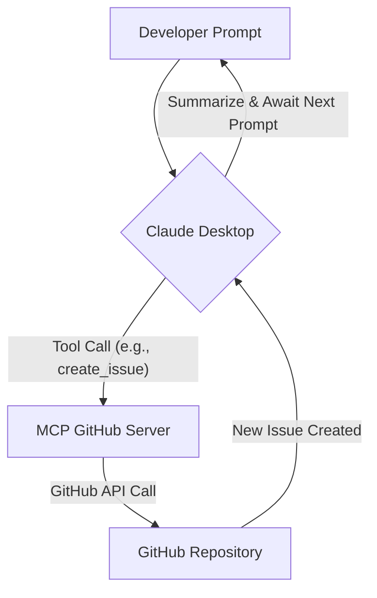

## Claude + MCP GitHub Contribution Manual

### 1. Introduction & Prerequisites

Welcome to the future of AI-assisted development! This manual provides a holistic guide to integrating Claude Desktop with your local development environment via the Model Context Protocol (MCP). By using specialized MCP servers running in Docker containers, Claude can interact with external tools and APIs, such as GitHub, directly from your desktop. This empowers Claude to act as a co-developer, assisting with tasks like creating issues, managing branches, making commits, and submitting pull requests—all under your direct supervision and approval.

The core idea is to extend Claude's natural language understanding and reasoning capabilities with practical execution power, keeping sensitive operations local and secure.

**1.1. What is MCP?**

The Model Context Protocol (MCP) is an open standard designed to enable Large Language Models (LLMs) to interact with external tools. It acts as a standardized communication layer, allowing an LLM client (like Claude Desktop) to:

*   **Discover Tools:** Learn about the capabilities of connected MCP servers.
*   **Request Execution:** Ask the server to run a specific tool with defined parameters.
*   **Receive Results:** Get structured output from the executed tool.
*   **Require User Approval:** Critical for security, MCP supports human-in-the-loop approval before executing sensitive operations.

**1.2. How Claude Desktop Integrates with MCP**

Claude Desktop includes built-in support for MCP. When configured, it detects available MCP servers, understands the tools they expose, and can intelligently suggest or execute these tools based on your prompts. All communication between Claude Desktop and your local MCP servers occurs on your machine, preventing sensitive data from leaving your environment unnecessarily.

**1.3. Prerequisites Checklist**

Before you begin, ensure you have the following in place:

*   **Docker Desktop:** Essential for running our MCP servers in isolated, consistent environments.
    *   **Download:** [https://docs.docker.com/desktop/](https://docs.docker.com/desktop/)
    *   **Installation Guide:** Follow the instructions for your specific operating system (Windows, macOS, Linux).
*   **Claude Desktop App:** Your primary AI interface.
    *   **Download:** [https://claude.ai/download](https://claude.ai/download)
    *   **Installation:** Install according to your OS.
*   **GitHub Account:** Required to interact with repositories.
*   **GitHub Personal Access Token (PAT):** This token grants programmatic access to your GitHub account.
    *   **Generate PAT:** Go to `GitHub Settings > Developer settings > Personal access tokens > Tokens (classic) > Generate new token`.
    *   **Scopes:** For this manual's workflow (creating issues, branches, commits, PRs), ensure the token has at least the following scopes:
        *   `repo` (full control of private repositories)
        *   `workflow` (to update GitHub Actions workflows)
    *   **Security Note:** Treat this PAT like a password. Do not hardcode it directly into scripts or public repositories. We will handle it securely using Docker secrets.
*   **Example Project Repository:** A simple GitHub repository (can be private or public) where you can test the workflow. It should have a `main` branch.
    *   Example: A basic Python project with a `README.md` and a `src/main.py`.

---

### 2. Local MCP Deployment (Part A)

This section guides you through deploying a specialized "GitHub MCP Server" using `docker-compose`. This server will expose tools for interacting with the GitHub API.

**2.1. GitHub MCP Server Structure**

We'll create a Python-based MCP server using `FastAPI` to expose the HTTP endpoint and `PyGithub` to interact with GitHub.

1.  **Project Directory Setup:**
    Create a new directory for your MCP server and navigate into it:
    ```bash
    mkdir github-mcp-server
    cd github-mcp-server
    ```

2.  **`github_mcp_server.py`:**
    Create this file and paste the following Python code. This server exposes tools for `create_issue`, `create_branch`, `commit_changes`, and `create_pull_request`.

    ```python
    import asyncio
    import os
    import json
    from github import Github
    from github.GithubException import GithubException, UnknownObjectException
    from mcp.server import MCPServer
    from mcp.tool import tool
    from fastapi import FastAPI, Request, Response
    import uvicorn

    app = FastAPI()

    class GitHubTools:
        def __init__(self):
            # Read GitHub PAT from a file specified by GITHUB_TOKEN_FILE env var
            # This is how Docker secrets are typically mounted and accessed.
            token_file = os.getenv("GITHUB_TOKEN_FILE", "/run/secrets/github_pat")
            if not os.path.exists(token_file):
                raise ValueError(f"GitHub token file not found at {token_file}. Ensure Docker secret is properly mounted.")
            with open(token_file, 'r') as f:
                self.github_pat = f.read().strip()
            self.g = Github(self.github_pat)
            print("GitHubTools initialized.")

        async def _get_repo(self, repo_owner: str, repo_name: str):
            try:
                user = await asyncio.to_thread(self.g.get_user, repo_owner)
                repo = await asyncio.to_thread(user.get_repo, repo_name)
                return repo
            except UnknownObjectException:
                raise ValueError(f"Repository {repo_owner}/{repo_name} not found or inaccessible.")
            except GithubException as e:
                raise ValueError(f"GitHub API error for repo {repo_owner}/{repo_name}: {e.data.get('message', str(e))}")

        @tool
        async def create_issue(self, repo_owner: str, repo_name: str, title: str, body: str) -> str:
            """
            Creates a new issue in the specified GitHub repository.
            :param repo_owner: The owner (user or organization) of the repository.
            :param repo_name: The name of the repository.
            :param title: The title of the issue.
            :param body: The detailed description of the issue.
            :return: A message indicating success or failure, with issue details.
            """
            try:
                repo = await self._get_repo(repo_owner, repo_name)
                issue = await asyncio.to_thread(repo.create_issue, title=title, body=body)
                return f"Successfully created issue #{issue.number}: '{issue.title}' at {issue.html_url}"
            except ValueError as e:
                return str(e)
            except GithubException as e:
                return f"Error creating issue: {e.data.get('message', str(e))}"

        @tool
        async def create_branch(self, repo_owner: str, repo_name: str, base_branch: str, new_branch_name: str) -> str:
            """
            Creates a new branch from a specified base branch in the repository.
            :param repo_owner: The owner (user or organization) of the repository.
            :param repo_name: The name of the repository.
            :param base_branch: The name of the branch to fork from (e.g., 'main').
            :param new_branch_name: The name of the new branch to create.
            :return: A message indicating success or failure.
            """
            try:
                repo = await self._get_repo(repo_owner, repo_name)
                source = await asyncio.to_thread(repo.get_branch, base_branch)
                await asyncio.to_thread(repo.create_git_ref, ref=f"refs/heads/{new_branch_name}", sha=source.commit.sha)
                return f"Successfully created branch '{new_branch_name}' from '{base_branch}' in {repo_owner}/{repo_name}."
            except ValueError as e:
                return str(e)
            except GithubException as e:
                return f"Error creating branch: {e.data.get('message', str(e))}"

        @tool
        async def commit_changes(self, repo_owner: str, repo_name: str, branch_name: str, file_path: str, new_content: str, commit_message: str) -> str:
            """
            Commits changes to a file on a specified branch. If the file doesn't exist, it's created.
            :param repo_owner: The owner of the repository.
            :param repo_name: The name of the repository.
            :param branch_name: The name of the branch to commit to.
            :param file_path: The path to the file to create or update.
            :param new_content: The full new content of the file.
            :param commit_message: The commit message.
            :return: A message indicating success or failure.
            """
            try:
                repo = await self._get_repo(repo_owner, repo_name)
                try:
                    contents = await asyncio.to_thread(repo.get_contents, file_path, ref=branch_name)
                    await asyncio.to_thread(repo.update_file, contents.path, commit_message, new_content, contents.sha, branch=branch_name)
                    return f"Successfully updated file '{file_path}' on branch '{branch_name}' in {repo_owner}/{repo_name}."
                except UnknownObjectException:
                    await asyncio.to_thread(repo.create_file, file_path, commit_message, new_content, branch=branch_name)
                    return f"Successfully created file '{file_path}' on branch '{branch_name}' in {repo_owner}/{repo_name}."
            except ValueError as e:
                return str(e)
            except GithubException as e:
                return f"Error committing changes: {e.data.get('message', str(e))}"

        @tool
        async def create_pull_request(self, repo_owner: str, repo_name: str, head_branch: str, base_branch: str, title: str, body: str) -> str:
            """
            Creates a new pull request from a head branch to a base branch.
            :param repo_owner: The owner (user or organization) of the repository.
            :param repo_name: The name of the repository.
            :param head_branch: The branch containing the changes to be merged (e.g., 'feature/my-feature').
            :param base_branch: The branch to merge the changes into (e.g., 'main').
            :param title: The title of the pull request.
            :param body: The detailed description of the pull request.
            :return: A message indicating success or failure, with PR details.
            """
            try:
                repo = await self._get_repo(repo_owner, repo_name)
                pull_request = await asyncio.to_thread(
                    repo.create_pull,
                    title=title,
                    body=body,
                    head=head_branch,
                    base=base_branch
                )
                return f"Successfully created Pull Request #{pull_request.number}: '{pull_request.title}' at {pull_request.html_url}"
            except ValueError as e:
                return str(e)
            except GithubException as e:
                return f"Error creating pull request: {e.data.get('message', str(e))}"

    # Instantiate the MCP server and attach the tools
    mcp_server_instance = MCPServer(tools=[GitHubTools()])

    # MCP endpoint for FastAPI to handle incoming tool requests from Claude Desktop
    @app.post("/mcp")
    async def mcp_handler(request: Request):
        try:
            req_body = await request.json()
            response_data = await mcp_server_instance.handle_request(req_body)
            return Response(content=json.dumps(response_data), media_type="application/json")
        except Exception as e:
            return Response(content=json.dumps({"error": str(e)}), status_code=500, media_type="application/json")

    # Health check endpoint for verifying server status
    @app.get("/health")
    async def health_check():
        return {"status": "ok", "message": "GitHub MCP Server is running."}

    if __name__ == "__main__":
        uvicorn.run(app, host="0.0.0.0", port=8081)
    ```

3.  **`requirements.txt`:**
    Create this file to list the Python dependencies:
    ```
    mcp-server
    PyGithub
    uvicorn
    fastapi
    ```

4.  **`Dockerfile`:**
    Create this file to define how to build the Docker image for your server:
    ```dockerfile
    # Use a lightweight Python base image
    FROM python:3.10-slim-buster

    # Set the working directory inside the container
    WORKDIR /app

    # Install system dependencies (e.g., git if needed, though PyGithub abstracts most git operations)
    RUN apt-get update && \
        apt-get install -y --no-install-recommends git && \
        rm -rf /var/lib/apt/lists/*

    # Copy the requirements file and install Python dependencies
    COPY requirements.txt .
    RUN pip install --no-cache-dir -r requirements.txt

    # Copy your Python server script
    COPY github_mcp_server.py .

    # Expose the port FastAPI will run on
    EXPOSE 8081

    # Command to run the FastAPI app with Uvicorn
    CMD ["uvicorn", "github_mcp_server:app", "--host", "0.0.0.0", "--port", "8081"]
    ```

**2.2. Docker Compose Setup (`docker-compose.yml`)**

This file orchestrates the Docker container(s) and securely injects your GitHub PAT using Docker secrets.

1.  **Create GitHub PAT Secret File:**
    Before running `docker-compose`, create a file containing your GitHub Personal Access Token. Replace `ghp_YOUR_PERSONAL_ACCESS_TOKEN_HERE` with your actual token.

    ```bash
    echo "ghp_YOUR_PERSONAL_ACCESS_TOKEN_HERE" > github_pat_file
    # Ensure this file is not committed to source control!
    ```
    *   **Security Note:** The `github_pat_file` should be outside of any version-controlled directory or listed in `.gitignore`. Docker Compose will read this file once to create the secret.

2.  **`docker-compose.yml`:**
    Create this file in the same `github-mcp-server` directory:
    ```yaml
    version: '3.8'

    services:
      github-mcp-server:
        build: . # Build from the current directory's Dockerfile
        ports:
          - "8081:8081" # Map container port 8081 to host port 8081
        environment:
          # Tell the Python script where to find the mounted secret file
          - GITHUB_TOKEN_FILE=/run/secrets/github_pat
        secrets:
          # Mount the github_pat secret into the container
          - github_pat
        restart: unless-stopped # Ensure the service restarts if it crashes

    secrets:
      github_pat:
        file: ./github_pat_file # Reference the local file containing your PAT
    ```
    *   **Docker Secrets Explanation:**
        *   The `secrets` section at the top level defines a secret named `github_pat` from your local `github_pat_file`.
        *   In the `github-mcp-server` service, `secrets: - github_pat` tells Docker Compose to make this secret available to the container.
        *   By default, Docker mounts secrets as files in `/run/secrets/`. So, our `github_pat` secret will be accessible inside the container at `/run/secrets/github_pat`.
        *   The `GITHUB_TOKEN_FILE` environment variable in the service configuration directs our Python script to this specific file. This is a secure way to handle sensitive credentials within containers.

**2.3. Running and Verifying MCP Servers**

1.  **Build and Start:**
    From your `github-mcp-server` directory, run:
    ```bash
    docker-compose up -d
    ```
    This command builds the Docker image (if it hasn't been built or changed) and starts the container in detached mode (`-d`).

2.  **Verify Server Status:**
    Check the logs to ensure the server started successfully:
    ```bash
    docker-compose logs github-mcp-server
    ```
    You should see messages indicating `GitHubTools initialized` and `Uvicorn` starting the server.

    You can also send a `curl` request to the health endpoint:
    ```bash
    curl http://localhost:8081/health
    ```
    Expected output: `{"status":"ok","message":"GitHub MCP Server is running."}`

    To see the available tools, you can try:
    ```bash
    curl -X POST -H "Content-Type: application/json" -d '{"jsonrpc": "2.0", "method": "mcp_getTools", "id": 1}' http://localhost:8081/mcp
    ```
    This should return a JSON array describing the `create_issue`, `create_branch`, `commit_changes`, and `create_pull_request` tools.

---

### 3. Using Claude Desktop with MCP (Part B)

Now that your GitHub MCP server is running, you can configure Claude Desktop to use it and begin interacting with GitHub through natural language prompts.

**3.1. Configure Claude Desktop**

1.  **Open Claude Desktop Settings:**
    Launch the Claude Desktop app.
    Go to `Settings` (usually represented by a gear icon).
    Navigate to the `Developer` section.
2.  **Edit Configuration:**
    Look for an "Edit Config" or similar button related to MCP servers. This will open the `claude_desktop_config.json` file in your default text editor.
3.  **Add MCP Server Configuration:**
    Add or modify the `mcpServers` section to include your `github-mcp-server`.

    ```json
    {
      "mcpServers": {
        "github_tools": {
          "transport": "streamable_http",
          "url": "http://localhost:8081/mcp"
        }
      },
      // Other Claude Desktop settings might be here
      "userPreferences": {}
    }
    ```
    *   **`github_tools`**: This is the arbitrary name you're giving to this MCP server within Claude. Claude will use this name to reference the tools.
    *   **`transport`**: Specifies the communication protocol. `streamable_http` is commonly used for HTTP-based MCP servers.
    *   **`url`**: The URL where your FastAPI-based MCP server is listening for requests.
4.  **Restart Claude Desktop:**
    Completely close and re-open the Claude Desktop app for the new configuration to take effect. You should see a small "hammer" icon or similar indicator in the prompt area, signifying that tools are available.

**3.2. Step-by-Step GitHub Contribution Workflow with Claude**

This section outlines a typical developer workflow for creating a feature using Claude, from issue creation to submitting a pull request. Assume your GitHub repository is named `my-org/my-repo`. **Remember to replace `my-org` and `my-repo` with your actual GitHub username/organization and repository name.**

**Workflow Diagram (Sequential Actions):**



---

#### Step 1: Create a New Issue

Let's start by having Claude create an issue for a new feature.

*   **Prompt:**
    ```
    Claude, use the `github_tools` MCP server to create a new issue for the repository 'my-org/my-repo'. The title should be 'Feature: Add user authentication module' and the description 'As a user, I want to be able to register and log in, so that I can access personalized content. This will involve creating new user models, authentication routes, and possibly a database schema.'
    ```
*   **Claude's Response (Example):**
    Claude will typically show you the tool call it intends to make, asking for your approval:
    > "I'm about to execute the `create_issue` tool with the following parameters:
    > `repo_owner`: 'my-org'
    > `repo_name`: 'my-repo'
    > `title`: 'Feature: Add user authentication module'
    > `body`: 'As a user, I want to be able to register and log in, so that I can access personalized content. This will involve creating new user models, authentication routes, and possibly a database schema.'
    > Do you approve this action?"

*   **Your Action:**
    Click "Approve" (or similar button in Claude Desktop).
*   **Claude's Follow-up (Example):**
    > "Successfully created issue #123: 'Feature: Add user authentication module' at https://github.com/my-org/my-repo/issues/123.
    > What would you like to do next?"

    *   *Note down the issue number (e.g., #123) for future reference.*

---

#### Step 2: Create a Feature Branch

Now, let's create a new branch based on the `main` branch for this feature.

*   **Prompt:**
    ```
    Claude, using the `github_tools` MCP server, create a new branch named `feature/user-auth` from the `main` branch in the 'my-org/my-repo' repository.
    ```
*   **Claude's Response (Example):**
    Claude will ask for approval to call `create_branch`.
*   **Your Action:**
    Approve the action.
*   **Claude's Follow-up (Example):**
    > "Successfully created branch 'feature/user-auth' from 'main' in my-org/my-repo.
    > The new branch is ready for your changes."

---

#### Step 3: Simulate Code Changes and Commit

This step simulates making a code change and committing it directly via the GitHub API. In a real-world scenario, you would manually make the changes in your local IDE, commit them, and push. Here, we use Claude to create or update a file.

*   **Prompt:**
    ```
    Claude, using the `github_tools` MCP server, commit the following changes to the file `src/auth.py` on the `feature/user-auth` branch in 'my-org/my-repo'. The commit message should be 'feat: Implement initial user authentication boilerplate'. The new content for `src/auth.py` is:

    ```python
    # src/auth.py
    def register_user(username, password):
        """Placeholder for user registration."""
        print(f"Registering {username}...")
        return {"status": "success", "user": username}

    def login_user(username, password):
        """Placeholder for user login."""
        print(f"Logging in {username}...")
        return {"status": "success", "user": username}

    if __name__ == "__main__":
        register_user("testuser", "password123")
        login_user("testuser", "password123")
    ```
    ```
*   **Claude's Response (Example):**
    Claude will ask for approval to call `commit_changes`.
*   **Your Action:**
    Approve the action.
*   **Claude's Follow-up (Example):**
    > "Successfully created file 'src/auth.py' on branch 'feature/user-auth' in my-org/my-repo. The commit message was 'feat: Implement initial user authentication boilerplate'."

---

#### Step 4: Create a Pull Request (PR)

Finally, let's have Claude create a pull request to merge the new feature branch into `main`.

*   **Prompt:**
    ```
    Claude, using the `github_tools` MCP server, create a pull request for the `feature/user-auth` branch into `main` for 'my-org/my-repo'. The title should be 'feat: Add user authentication module' and the description 'This PR introduces the basic structure for user registration and login functionality. Closes #123'.
    ```
    *   **Remember to replace `#123` with the actual issue number Claude created in Step 1.**
*   **Claude's Response (Example):**
    Claude will ask for approval to call `create_pull_request`.
*   **Your Action:**
    Approve the action.
*   **Claude's Follow-up (Example):**
    > "Successfully created Pull Request #456: 'feat: Add user authentication module' at https://github.com/my-org/my-repo/pull/456.
    > The PR is now ready for review and will trigger your CI pipeline."

    *   *Note down the PR number (e.g., #456).*

---

### 4. Automating with CI/CD (Part C)

This section details how the pull requests created by Claude can automatically trigger your Continuous Integration (CI) pipeline using GitHub Actions. This ensures that any AI-assisted code changes adhere to your project's quality standards.

**4.1. GitHub Actions Template (`.github/workflows/ci.yml`)**

This example GitHub Actions workflow will run automated tests and linting whenever a pull request is opened targeting the `main` branch.

1.  **Create Workflow Directory:**
    In your GitHub repository (e.g., `my-org/my-repo`), ensure you have a `.github/workflows` directory. If not, create it:
    ```bash
    # In your local clone of my-org/my-repo
    mkdir -p .github/workflows
    ```

2.  **`ci.yml` File:**
    Create a file named `ci.yml` inside the `.github/workflows` directory and paste the following content.

    ```yaml
    name: CI Pipeline

    on:
      pull_request:
        branches: [ main ] # Trigger this workflow when a PR targets the 'main' branch

    jobs:
      build-and-test:
        runs-on: ubuntu-latest # Run on a fresh Ubuntu environment

        steps:
          - name: Checkout code
            uses: actions/checkout@v4 # Action to checkout the repository code

          - name: Set up Python
            uses: actions/setup-python@v5
            with:
              python-version: '3.9' # Specify your project's Python version

          - name: Install dependencies
            run: |
              python -m pip install --upgrade pip
              pip install pytest flake8 # Install testing and linting tools
              # If your project has a requirements.txt, use:
              # pip install -r requirements.txt

          - name: Run tests
            run: |
              pytest # Execute your project's test suite

          - name: Run linting
            run: |
              flake8 . --count --select=E9,F63,F7,F82 --show-source --statistics
              flake8 . --count --exit-zero --max-complexity=10 --max-line-length=120 --statistics
    ```

3.  **Commit and Push the Workflow:**
    You'll need to manually commit and push this `ci.yml` file to your `main` branch once. This is a one-time setup for the CI system itself.

    ```bash
    # In your local clone of my-org/my-repo
    git checkout main
    git add .github/workflows/ci.yml
    git commit -m "ci: Add GitHub Actions workflow for pull requests"
    git push origin main
    ```

**4.2. How PRs Created via MCP Trigger CI**

Once the `ci.yml` workflow is pushed to your `main` branch, any subsequent pull requests that are opened targeting `main` (regardless of who or what created them) will automatically trigger this CI pipeline.

*   When Claude, via your MCP server, creates a pull request (as demonstrated in Part B, Step 4), GitHub detects this new PR event.
*   The `on: pull_request: branches: [ main ]` configuration in `ci.yml` matches this event.
*   GitHub Actions then provisions a runner, checks out the code from the PR's branch, and executes all defined steps (install dependencies, run tests, run linting).
*   The results of the CI pipeline (pass or fail) will be displayed directly on the GitHub pull request page, providing immediate feedback on the quality and correctness of the AI-generated or AI-assisted changes. This allows human reviewers to quickly assess the impact and merge readiness of the PR.

**4.3. Security Considerations for CI/CD**

*   **GitHub PAT Scope:** Ensure the PAT used by your MCP server has the `workflow` scope. This is necessary if the MCP server itself were to create or modify GitHub Actions workflows (though our example only creates code that *triggers* CI).
*   **Branch Protection Rules:** Implement branch protection rules on your `main` branch (and other critical branches) to require passing status checks (from CI) before merging. This is crucial for maintaining code quality.
*   **Secrets in CI:** If your CI pipeline requires any sensitive information (e.g., API keys for deployment), store them as GitHub Secrets within your repository's settings, not directly in the `ci.yml` file.

---

### 5. End-to-End Flow Diagram

This diagram illustrates the complete AI-assisted development workflow, from developer prompt to CI/CD feedback.

```mermaid
graph TD
    subgraph Local Environment
        A[Developer] --> B(Claude Desktop App)
        B -- Tool Call (MCP) --> C(MCP GitHub Server <br> (Docker Container))
    end

    subgraph GitHub Ecosystem
        C -- GitHub API Calls --> D(GitHub Repository)
        D -- Pull Request Event --> E(GitHub Actions)
        E -- Run CI Pipeline --> F(CI/CD Results & Status Checks)
        F -- Update PR Status --> D
    end

    D -- Status/Notifications --> H(GitHub UI)
    H --> A
    C -- Results/Summaries --> B
    B -- Summarized Info --> A
```

**Flow Explanation:**

1.  **Developer Prompt:** The developer initiates a task in natural language within the Claude Desktop app.
2.  **Claude Desktop App:** Claude interprets the prompt, identifies the need for an external tool, and based on the `claude_desktop_config.json`, selects a tool from the `github_tools` MCP server.
3.  **MCP GitHub Server (Docker Container):** Claude sends an MCP request to the local `github-mcp-server`. After developer approval, the server executes the corresponding Python function (e.g., `create_issue`, `create_pull_request`).
4.  **GitHub API Calls:** The MCP GitHub Server uses `PyGithub` and the securely mounted GitHub PAT to make authenticated API calls to GitHub.
5.  **GitHub Repository:** GitHub processes the API calls, resulting in actions like a new issue, branch, commit, or pull request.
6.  **Pull Request Event:** When a pull request is created (especially targeting `main`), GitHub emits a `pull_request` event.
7.  **GitHub Actions:** The `ci.yml` workflow listens for this event and triggers the CI pipeline.
8.  **CI/CD Results & Status Checks:** The CI pipeline runs tests, linting, etc. The results are reported back to the GitHub repository as status checks on the pull request.
9.  **GitHub UI / Notifications:** The developer can view the status of the PR and CI checks directly in the GitHub web interface or through notifications.
10. **Results/Summaries Back to Claude & Developer:** The MCP server returns the outcome of its operations to Claude. Claude then synthesizes this information and presents it to the developer, completing the feedback loop.

---

### 6. Master Checklist

This consolidated checklist guides you through the entire process, ensuring no steps are missed.

**6.1. Initial Setup & Prerequisites**

*   [ ] Install Docker Desktop for your OS.
*   [ ] Install Claude Desktop for your OS.
*   [ ] Create a GitHub Personal Access Token (PAT) with `repo` and `workflow` scopes.
*   [ ] Have an example GitHub repository ready (`my-org/my-repo`).
*   [ ] Clone your example repository locally.

**6.2. MCP Server Deployment (Part A)**

*   [ ] Create project directory: `github-mcp-server`.
*   [ ] Create `github_mcp_server.py` with the provided code.
*   [ ] Create `requirements.txt` with the specified dependencies (`mcp-server`, `PyGithub`, `uvicorn`, `fastapi`).
*   [ ] Create `Dockerfile` with the provided instructions.
*   [ ] Create `github_pat_file` in the `github-mcp-server` directory (and add to `.gitignore` if within a repo) containing your GitHub PAT.
*   [ ] Create `docker-compose.yml` with the provided configuration, ensuring correct secret mapping.
*   [ ] Build and start the MCP server containers: `docker-compose up -d`.
*   [ ] Verify the MCP server is running: `docker-compose logs github-mcp-server` and `curl http://localhost:8081/health`.

**6.3. Claude Desktop Configuration**

*   [ ] Open Claude Desktop `Settings > Developer`.
*   [ ] Click "Edit Config" for MCP servers.
*   [ ] Add the `github_tools` configuration to `claude_desktop_config.json` with `http://localhost:8081/mcp` as the URL.
*   [ ] Completely restart the Claude Desktop app.

**6.4. Usage with Claude Desktop (Part B)**

*   [ ] **Create Issue:** Prompt Claude to create an issue for your repository.
    *   [ ] Review and approve the tool execution.
    *   [ ] Note the issue number.
*   [ ] **Create Branch:** Prompt Claude to create a new feature branch from `main`.
    *   [ ] Review and approve the tool execution.
*   [ ] **Commit Changes:** Prompt Claude to commit changes to a file on your new branch.
    *   [ ] Review and approve the tool execution.
*   [ ] **Create Pull Request:** Prompt Claude to create a pull request from your feature branch to `main`, linking the issue.
    *   [ ] Review and approve the tool execution.
    *   [ ] Note the PR number.
    *   [ ] Verify the issue, branch, commit, and PR in your GitHub repository's UI.

**6.5. CI/CD Integration (Part C)**

*   [ ] In your local clone of `my-org/my-repo`, create the directory `.github/workflows`.
*   [ ] Create `ci.yml` inside `.github/workflows` with the provided GitHub Actions template.
*   [ ] Commit and push `ci.yml` to the `main` branch of your repository.
*   [ ] Observe the GitHub Actions pipeline running on the PR created by Claude.
*   [ ] Review the CI results on the GitHub PR page.

**6.6. Security & Best Practices**

*   [ ] Regularly review the scopes of your GitHub PAT.
*   [ ] Never hardcode sensitive credentials directly into scripts or `docker-compose.yml` (always use Docker secrets or GitHub secrets).
*   [ ] Enable branch protection rules in GitHub for critical branches (e.g., `main`) to enforce passing CI checks.
*   [ ] Always review AI-generated or AI-assisted code/PRs. AI is a co-pilot, not an autonomous agent.

---

### 7. Appendices

**7.1. References and Official Documentation**

*   **Claude Desktop Download:** [https://claude.ai/download](https://claude.ai/download)
*   **Docker Desktop Installation Guides:** [https://docs.docker.com/desktop/](https://docs.docker.com/desktop/)
*   **GitHub Personal Access Tokens (PATs) Documentation:** [https://docs.github.com/en/authentication/keeping-your-account-and-data-secure/managing-your-personal-access-tokens](https://docs.github.com/en/authentication/keeping-your-account-and-data-secure/managing-your-personal-access-tokens)
*   **GitHub Actions Documentation:** [https://docs.github.com/en/actions](https://docs.github.com/en/actions)
*   **`mcp-server` Python Library (PyPI):** [https://pypi.org/project/mcp-server/](https://pypi.org/project/mcp-server/)
*   **`PyGithub` Python Library (PyPI):** [https://pypi.org/project/PyGithub/](https://pypi.org/project/PyGithub/)
*   **`FastAPI` Documentation:** [https://fastapi.tiangolo.com/](https://fastapi.tiangolo.com/)

---

https://aistudio.google.com/app/prompts?state=%7B%22ids%22:%5B%221dtHxgGsmEv-v5AaGbyxJtE6j7C5XiXBE%22%5D,%22action%22:%22open%22,%22userId%22:%22108686197475781557359%22,%22resourceKeys%22:%7B%7D%7D&usp=sharing
