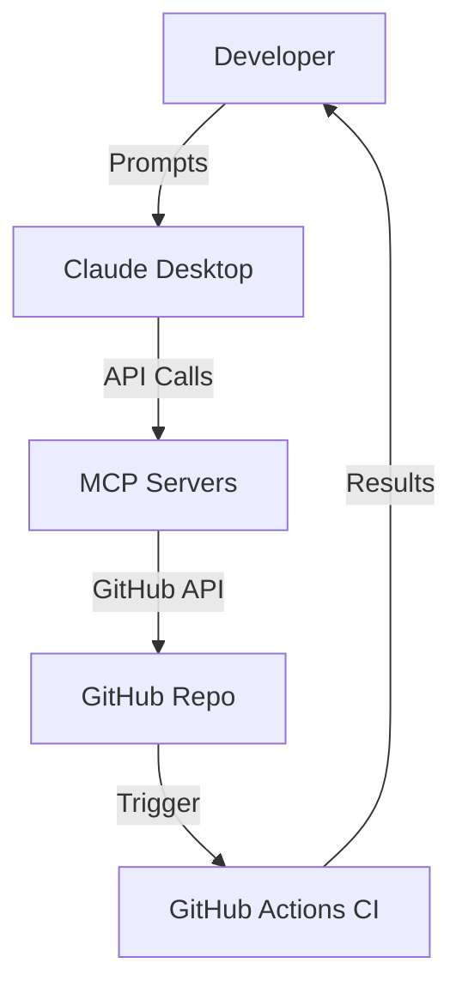

# Claude + MCP Server 🚀  
*Your One-Stop Playbook for GitHub Contributions via Claude Desktop*  

[](https://hub.docker.com/)  
[](https://github.com/features/actions)  
[](./LICENSE)  

---

## 📖 Overview  

This repository hosts the **Claude + MCP GitHub Contribution Manual**, a complete workflow for leveraging **Claude Desktop** and **MCP servers** to contribute to GitHub repositories.  

It combines:  
- 🐳 **Dockerized MCP servers** for GitHub + Git/Shell  
- 🤖 **Prompt templates** for Claude Desktop workflows  
- ✅ **CI/CD automation** with GitHub Actions  
- 🔗 **End-to-end flow diagrams** and checklists  

---

## ✨ Features  

- Secure deployment of MCP servers with Docker + secrets  
- Ready-to-paste Claude Desktop prompts for GitHub contribution tasks  
- Automated CI/CD testing of MCP-created pull requests  
- Visual flow diagrams for clarity  
- Master checklist for teams  

---

## 🔧 Prerequisites  

- [Claude Desktop](https://claude.ai/download)  
- [Docker Desktop](https://docs.docker.com/desktop/)  
- GitHub account with **Personal Access Token (PAT)** (`repo` + `workflow` scopes)  
- Basic familiarity with Git and GitHub  

---

## 🚀 Quick Start  

### 1. Clone the repo  

```bash
git clone https://github.com/nordeim/Claude-MCP-Server.git
cd Claude-MCP-Server
````

### 2. Create environment + secrets

**.env**

```bash
GITHUB_MCP_PORT=8081
GIT_SHELL_MCP_PORT=8082
```

**secrets/github\_token.txt**

```bash
ghp_xxxxxxxx
```

### 3. Start MCP servers

```bash
docker compose up -d
```

Verify containers:

```bash
docker ps
```

---

## 🛠 Usage with Claude Desktop

Once MCP servers are running, configure Claude Desktop to connect.
Then use these prompts step by step:

### Create GitHub Issue

```
Use github.create_issue on https://github.com/nordeim/Frontend.git
Title: "Bug: Navbar links not working"
Description: "Steps to reproduce: ... Expected: ..."
```

### Create Branch

```
Use github.create_ref on https://github.com/nordeim/Frontend.git
Branch: fix/navbar-links from main
```

### Clone Repo

```
Use git.clone https://github.com/nordeim/Frontend.git into /workspace/Frontend
```

### Commit & Push

```
In /workspace/Frontend, use git.commit_and_push
Commit: "Fix: corrected broken navbar link navigation"
Branch: fix/navbar-links
```

### Create Pull Request

```
Use github.create_pull_request
From: fix/navbar-links → main
Title: "Fix navbar link navigation"
Description: "This PR fixes the broken navbar link issue."
```

---

## ⚙️ CI/CD Integration

Add this workflow in `.github/workflows/ci.yml`:

```yaml
name: CI for MCP PRs

on:
  pull_request:
    branches: [ "main" ]

jobs:
  build:
    runs-on: ubuntu-latest
    steps:
      - uses: actions/checkout@v3
      - uses: actions/setup-node@v3
        with:
          node-version: "20"
      - run: npm install
      - run: npm test
```

---

## 📊 Workflow Diagram



---

## ✅ Master Checklist

* [x] Install prerequisites (Claude, Docker, PAT)
* [x] Deploy MCP servers
* [x] Configure Claude Desktop
* [x] Run GitHub workflow via prompts
* [x] Verify CI/CD pipeline runs

---

## 🤝 Contributing

Contributions are welcome!

* Fork the repo
* Create a feature branch
* Open a pull request

Please check out our [CONTRIBUTING.md](./CONTRIBUTING.md) for guidelines.

---

## 📜 License

This project is licensed under the [MIT License](./LICENSE).

Would you like me to also generate a **matching `docs/` folder** with expanded versions of the manual, prompts, and CI setup so the `README.md` stays concise, while deep technical detail is preserved separately?
```
