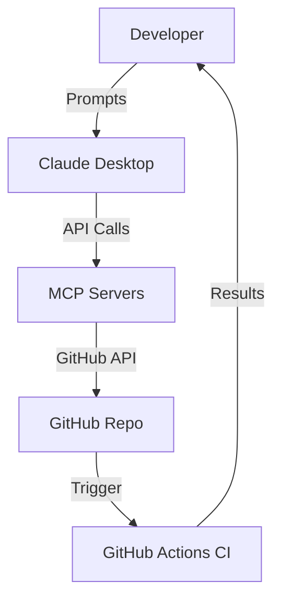

<contemplator>  
Okay, so the user now wants me to create a `README.md` for a repo called **Claude-MCP-Server** at `https://github.com/nordeim/Claude-MCP-Server`.  

I need to make it equally awesome, informative, and helpful as the guides I’ve been producing in this thread. That means:

* It should introduce what the repo is about (MCP server workflows for Claude Desktop).
* Provide context: MCP integration, Claude Desktop, GitHub workflows, etc.
* Highlight why this repo matters: it serves as a central reference and playbook.
* Include:

  * **Overview**
  * **Features**
  * **Prerequisites**
  * **Installation/Setup** (docker-compose, env files, secrets)
  * **Usage** (example Claude prompts)
  * **Workflow examples** (issues, branches, PRs)
  * **CI/CD integration** (GitHub Actions)
  * **Flow diagram**
  * **Contributing** section
  * **License**

It should balance readability and technical depth. Markdown formatting with clear headers, code blocks, and maybe a Mermaid diagram for visual clarity.

Also, since this is a README, it needs to be slightly more polished and explanatory than the “manual” above, but not too bloated — enough that someone landing on the repo quickly understands the purpose and how to use it.

I’ll integrate the **master playbook** content but structure it for a GitHub audience. Cross-link sections with anchor links for navigation.

I should also add badges (Docker, GitHub Actions, License) for extra polish. Even if placeholders, they show professionalism.

Yes, I think I have a good plan: create a polished, production-ready `README.md` with a structure like:

1. Title + badges
2. Introduction
3. Features
4. Prerequisites
5. Quick Start (docker-compose setup)
6. Usage examples (Claude prompts)
7. CI/CD workflow example
8. Flow diagram
9. Contributing
10. License

Let’s now write it. </contemplator>

\<final\_answer>
Here’s a polished `README.md` for the repo **Claude-MCP-Server**:

````markdown
# Claude + MCP Server üöÄ  
*Your One-Stop Playbook for GitHub Contributions via Claude Desktop*  

[](https://hub.docker.com/)  
[](https://github.com/features/actions)  
[](./LICENSE)  

---

## üìñ Overview  

This repository hosts the **Claude + MCP GitHub Contribution Manual**, a complete workflow for leveraging **Claude Desktop** and **MCP servers** to contribute to GitHub repositories.  

It combines:  
- üê≥ **Dockerized MCP servers** for GitHub + Git/Shell  
- 🤖 **Prompt templates** for Claude Desktop workflows  
- ‚úÖ **CI/CD automation** with GitHub Actions  
- üîó **End-to-end flow diagrams** and checklists  

---

## ‚ú® Features  

- Secure deployment of MCP servers with Docker + secrets  
- Ready-to-paste Claude Desktop prompts for GitHub contribution tasks  
- Automated CI/CD testing of MCP-created pull requests  
- Visual flow diagrams for clarity  
- Master checklist for teams  

---

## üîß Prerequisites  

- [Claude Desktop](https://claude.ai/download)  
- [Docker Desktop](https://docs.docker.com/desktop/)  
- GitHub account with **Personal Access Token (PAT)** (`repo` + `workflow` scopes)  
- Basic familiarity with Git and GitHub  

---

## üöÄ Quick Start  

### 1. Clone the repo  

```bash
git clone https://github.com/nordeim/Claude-MCP-Server.git
cd Claude-MCP-Server
````

### 2. Create environment + secrets

**.env**

```bash
GITHUB_MCP_PORT=8081
GIT_SHELL_MCP_PORT=8082
```

**secrets/github\_token.txt**

```bash
ghp_xxxxxxxx
```

### 3. Start MCP servers

```bash
docker compose up -d
```

Verify containers:

```bash
docker ps
```

---

## üõ† Usage with Claude Desktop

Once MCP servers are running, configure Claude Desktop to connect.
Then use these prompts step by step:

### Create GitHub Issue

```
Use github.create_issue on https://github.com/nordeim/Frontend.git
Title: "Bug: Navbar links not working"
Description: "Steps to reproduce: ... Expected: ..."
```

### Create Branch

```
Use github.create_ref on https://github.com/nordeim/Frontend.git
Branch: fix/navbar-links from main
```

### Clone Repo

```
Use git.clone https://github.com/nordeim/Frontend.git into /workspace/Frontend
```

### Commit & Push

```
In /workspace/Frontend, use git.commit_and_push
Commit: "Fix: corrected broken navbar link navigation"
Branch: fix/navbar-links
```

### Create Pull Request

```
Use github.create_pull_request
From: fix/navbar-links ‚Üí main
Title: "Fix navbar link navigation"
Description: "This PR fixes the broken navbar link issue."
```

---

## ⚙️ CI/CD Integration

Add this workflow in `.github/workflows/ci.yml`:

```yaml
name: CI for MCP PRs

on:
  pull_request:
    branches: [ "main" ]

jobs:
  build:
    runs-on: ubuntu-latest
    steps:
      - uses: actions/checkout@v3
      - uses: actions/setup-node@v3
        with:
          node-version: "20"
      - run: npm install
      - run: npm test
```

---

## üìä Workflow Diagram



---

## ‚úÖ Master Checklist

* [x] Install prerequisites (Claude, Docker, PAT)
* [x] Deploy MCP servers
* [x] Configure Claude Desktop
* [x] Run GitHub workflow via prompts
* [x] Verify CI/CD pipeline runs

---

## 🤝 Contributing

Contributions are welcome!

* Fork the repo
* Create a feature branch
* Open a pull request

Please check out our [CONTRIBUTING.md](./CONTRIBUTING.md) for guidelines.

---

## üìú License

This project is licensed under the [MIT License](./LICENSE).

---

```
</final_answer>  

Would you like me to also generate a **matching `docs/` folder** with expanded versions of the manual, prompts, and CI setup so the `README.md` stays concise, while deep technical detail is preserved separately?
```
